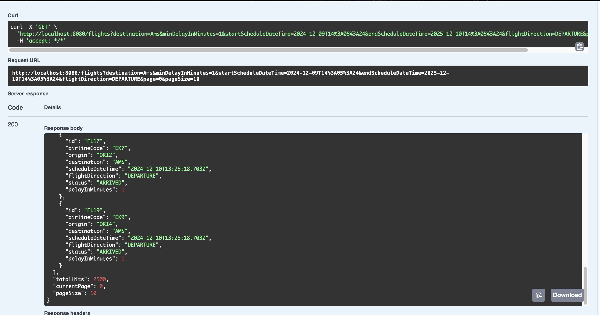

# Flights API

## Overview
A Spring Boot application that provides flight information using Elasticsearch.

## Features
- Retrieve flight information with filtering options.
- Elasticsearch integration for storing and querying flight data.
- Swagger API documentation.
- End-to-end testing with Testcontainers.

## Prerequisites
To use this project, ensure you have the following installed:
- Docker
- Java 17+
- Maven

## How to Build and Run

1. Clone the repository by running: `git clone https://github.com/hareeshav/flights-api.git` and navigate into the project directory with `cd flights-api`.

2. Build the project using Maven: `mvn clean install`.

3. Run the application with Docker Compose: `docker-compose up --build`.  
   Once the application is running, you can access it at:
    - API Base URL: [http://localhost:8080](http://localhost:8080)
    - Swagger UI: [http://localhost:8080/swagger-ui.html](http://localhost:8080/swagger-ui.html)

4. Run integration and unit tests with: `mvn test`.

## Sample Request

curl -X 'GET' \
'http://localhost:8080/flights?destination=Ams&minDelayInMinutes=10&startScheduleDateTime=2024-12-09T12%3A28%3A49&endScheduleDateTime=2024-12-10T12%3A28%3A49&flightDirection=DEPARTURE&page=0&pageSize=0' \
-H 'accept: */*'

## Sample Response

## Future Improvements
- Add authentication for the API.
- Application Profiling
- Setting up logger
